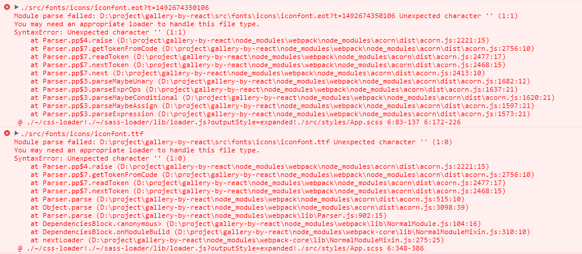

## React实现图片画廊效果
初学React， 用这个小项目练练手

[慕课网课程](http://www.imooc.com/learn/507)

[点我看demo](https://wanglei-0707.github.io/gallery-by-react/)

## 技术栈
React + scss + yeoman + generator-react-webpack

```
npm install -g yo
npm install -g generator-react-webpack
mkdir my-new-project && cd my-new-project
yo react-webpack
npm run serve
npm run dist //打包
```

## scss
1. @at-root: 可以使选择器不嵌套，而是将内部的选择器放在全局上。

```
.img-sec{
    @at-root{
        .img-figure{}
        .img-back{}
    }
}

//编译后

.img-sec{}
.img-figure{}
.img-back{}
```

## css3实现卡片翻转
perspective + transform-origin + transform-style + transform: rotateY + backface-visibility: hidden;
1. perspective: 这个属性规定观察者与z=0平面的距离，使具有三维位置变化的元素产生透视效果。这个属性设置在包裹元素上。当为元素设置该属性后，其子元素会获得透视效果，而不是元素本身。
2. transform-style: flat(子元素不保留3D位置) | preserve-3d(子元素保留3d位置)
3. backface-visibility: visible | hidden 定义当元素不面向屏幕时元素是否可见

## react
### this.refs
使用this.refs的情况：
* 管理focus，text selection， media playback
* 触发必要的动画
* 整合第三方DOM库
#### 添加ref到一个DOM元素上
为ref指定一个回调函数，这个回调函数会在组件mounted或者unmouted之后立即执行。当ref被使用在一个HTML元素上时，ref指定的回调函数接收当前的DOM元素作为参数。官网例子：
```
class CustomTextInput extends React.Component {
  constructor(props) {
    super(props);
    this.focus = this.focus.bind(this);
  }

  focus() {
    // Explicitly focus the text input using the raw DOM API
    **this.textInput.focus();**
  }

  render() {
    // Use the `ref` callback to store a reference to the text input DOM
    // element in an instance field (for example, this.textInput).
    return (
      <div>
        <input
          type="text"
          **ref={(input) => { this.textInput = input; }} />**
        <input
          type="button"
          value="Focus the text input"
          onClick={this.focus}
        />
      </div>
    );
  }
}
```
#### 添加ref到一个类组件上
当ref应用在一个本地类组件上，ref的回调函数接收这个组件的mouted组件实例作为参数。注意，只有当CustomTextInput被声明为一个类时才有作用。当需要使用该组件对应的DOM节点时，可以通过ReactDOM.findDOMNode()方法获得
```
class AutoFocusTextInput extends React.Component {
  componentDidMount() {
    this.textInput.focus();
  }

  render() {
    return (
      <CustomTextInput
        ref={(input) => { this.textInput = input; }} />
    );
  }
}
```
#### 官网不建议使用的String ref
教程中使用的ref为字符串的方式现在官网已经不建议使用
#### 警告
如果ref的callback被定义为inline function，这个函数在updates期间将被调用两次，一次参数为null，一次参数为DOM元素，这是因为每次render都会创建一个新的function实例，所以React需要清除旧的ref然后设置新的。可以将ref的callback定义为class内部的方法来避免这种情况，但是大多数情况下这个问题并不会有什么影响。

### ReactDOM.findDOMNode(component)
如果component已经mounted into DOM中，这个函数会返回一个响应的本地浏览器DOM元素，这个方法在读取DOM的value时很有用，比如表单字段的值。但是大多数情况下，都可以使用ref来避免使用findDOMNode。当render返回null或者false时，findDOMNode返回null。

ref={(section)=>{this.section = section}}
ref={(figure)=>{this['figure'+index] = figure;}}
ref={'figure'+index}
ref="stage"

2. ES6写法的组件事件处理函数，状态设置
```
class ControllerUnit extends React.Component {
    constructor (props) {
        super(props);
        this.handleClick = this.handleClick.bind(this);
        this.state = {};
    }
    handleClick (e) {
        //
        e.stopPropagation();
        e.preventDefault();
    }
    render () {
        return (
            <span className={className} onClick={this.handleClick}></span>
        );
    }
}
```
### 如何获取组件中的真实DOM元素。
教程中原本使用ReactDOM.findDOMNode()方法将虚拟DOM转为真实的DOM，但是我看官网中对findDOMNode()方法的介绍中写道，大多数情况下都可以用ref callback来替代findDOMNode，但是当ref用在一个类组件上时，获得的也是组件的虚拟DOM不是真实DOM，所以我还是得用findDOMNode()来转为真实的DOM。网上也很多说是用这个函数，不知道这种处理方法合不合适。

## git相关
之前使用git-pages都是在GitHub官网上的settings里设置，课程里讲到了使用如下命令可以直接将dist文件夹push到gh-pages分支上
```
git subtree push --prefix=<子目录名> <远程分支名> 分支
git subtree push --prefix=dist origin gh-pages
```
要注意的一个问题是直接推上去后访问会存在路径不对的问题，如果cfg文件夹下的defaults.js文件里的publicPath设置为'/assets/'，则index.html中引用外部文件时使用的路径应为"assets/app.js"。

webpack配置中path仅仅告诉webpack打包的结果存储在哪里，而publicPath指定资源引用的目录

## 遇到的问题
1. Error: listen EACCES 127.0.0.1:8000    

    换个端口就好了
2. 使用iconfont矢量图标时，添加iconfont.css里的文件后报错
.原本每种字体文件都处理不了，但是把eot和svg url中“？”后面的删掉了之后可以了，但是ttf和eot文件还是不行！！！

    醉了！！！查了一个小时，调了一个小时，还是没解决，突然间想到难道是需要重启一下服务器？然后就重启了一下，然后就真的没问题了！！！！！
